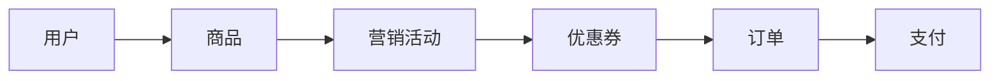
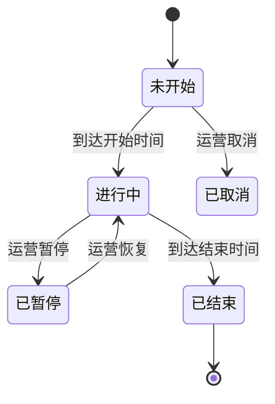
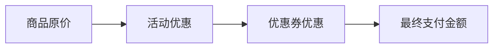
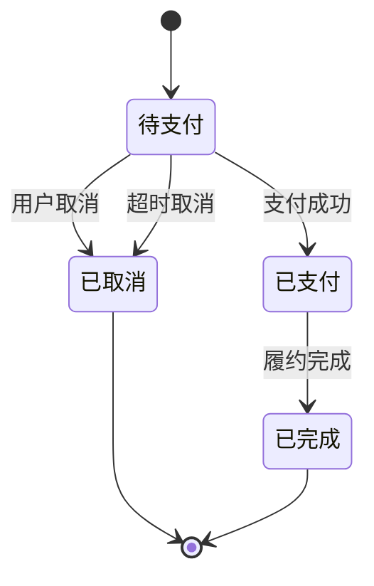
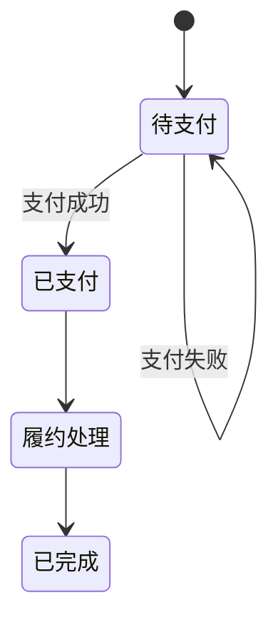
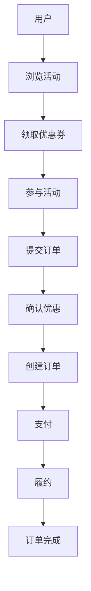
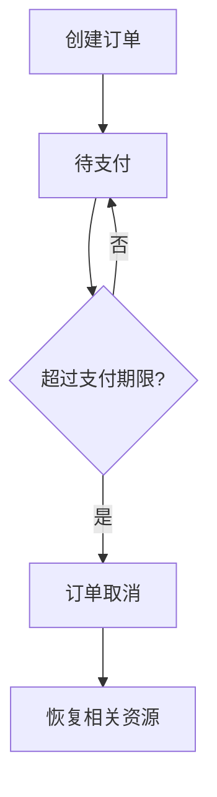
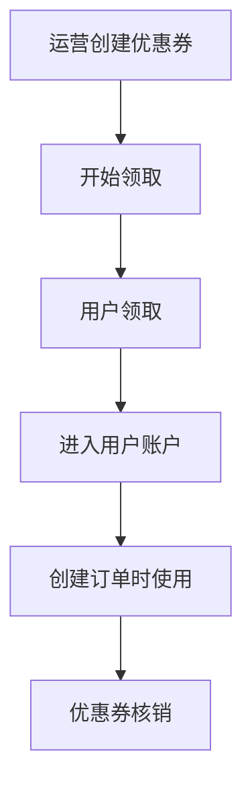
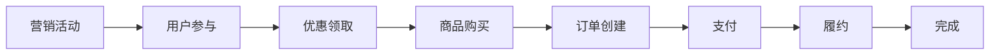

## 目录

- [一页速览](#一页速览)
- [1. 产品概述](#1-产品概述)
- [2. 用户角色](#2-用户角色)
- [3. 核心业务模型](#3-核心业务模型)
- [4. 商品管理](#4-商品管理)
- [5. 优惠券](#5-优惠券)
- [6. 限时营销活动](#6-限时营销活动)
- [7. 订单](#7-订单)
- [8. 订单超时](#8-订单超时)
- [9. 支付](#9-支付)
- [10. 订单履约](#10-订单履约)
- [11. 用户端功能](#11-用户端功能)
- [12. 运营端功能](#12-运营端功能)
- [13. 核心业务规则](#13-核心业务规则)
- [14. 关键异常场景](#14-关键异常场景)
- [15. 非功能需求](#15-非功能需求)
- [16. 第一阶段范围](#16-第一阶段范围)
- [17. 核心业务流程](#17-核心业务流程)
- [18. 产品验收标准](#18-产品验收标准)
- [19. 产品成功标准](#19-产品成功标准)
- [20. 已确认业务决策](#20-已确认业务决策)
- [21. 术语表](#21-术语表)

## 一页速览

- **产品一句话：** 运营创建限时活动与优惠券，用户领券后参与活动、下单、支付、履约。
- **核心闭环：** 营销活动 → 用户参与 → 优惠领取 → 商品购买 → 订单创建 → 支付 → 履约 → 完成。
- **第一阶段范围：** 用户、商品、普通直接购买、多商品直接订单、优惠券、限时活动、订单、模拟支付、超时取消、履约、运营管理、高并发测试。
- **不包含：** 真实支付、物流、退款、购物车、积分、会员等级、推荐、多商户、复杂优惠组合。
- **核心约束：** 不超卖、不超发、不重复下单、不重复支付、不非法状态流转。
- **重点异常：** 高并发、库存竞争、重复请求、订单超时、优惠券竞争、支付竞争、异常恢复。
- **已确认业务决策：** 见第 20 章。

---

## 1. 产品概述

### 1.1 产品背景

平台面向消费者提供商品购买和营销优惠服务。运营人员可针对指定商品创建限时营销活动，并通过优惠券等方式吸引用户参与。用户可浏览活动、领取优惠券、购买活动商品并完成支付。平台需支持热门活动开始时大量用户同时访问，并保证库存、优惠券、订单等核心业务数据准确。

### 1.2 产品目标

| 目标 | 说明 |
|---|---|
| 营销活动 | 支持运营人员创建和管理限时优惠活动 |
| 用户优惠 | 支持优惠券领取、使用和管理 |
| 商品交易 | 支持用户购买商品并完成支付 |
| 订单管理 | 支持订单创建、支付、取消、完成 |
| 资源控制 | 保证库存、优惠券等有限资源不会被超额使用 |
| 高并发 | 支持热门活动期间大量用户同时参与 |

---

## 2. 用户角色

| 角色 | 核心操作 |
|---|---|
| 普通用户 | 浏览商品、参加活动、领取优惠券、下单、支付、查看订单 |
| 运营人员 | 管理商品、创建营销活动、管理优惠券、查看活动数据 |

---

## 3. 核心业务模型



| 对象 | 说明 |
|---|---|
| 用户 | 平台消费者，参与活动、领券、下单、支付 |
| 商品 | 实际销售的商品 |
| 营销活动 | 针对商品提供限时优惠 |
| 优惠券 | 为用户提供额外的订单优惠 |
| 订单 | 记录用户购买行为及最终价格 |
| 支付 | 记录订单的支付结果 |

---

## 4. 商品管理

### 4.1 商品信息

| 字段 | 说明 |
|---|---|
| 商品名称 | 商品展示名称 |
| 商品描述 | 商品详细描述 |
| 商品价格 | 当前商品销售价格 |
| 商品库存 | 当前可销售数量 |
| 商品状态 | 上架 / 下架 |

### 4.2 商品规则

- 只有上架商品可以被购买。
- 商品库存不足时，用户无法继续购买。
- 商品价格发生变化后，不影响已经创建的订单。
- 用户可创建普通直接订单；普通直接订单可包含多个商品项，但不包含活动商品项。

---

## 5. 优惠券

### 5.1 优惠券配置

| 配置项 | 示例 | 说明 |
|---|---|---|
| 名称 | 满100减20 | 优惠券展示名称 |
| 使用门槛 | 满100元 | 订单金额需达到门槛 |
| 优惠金额 | 20元 | 满足门槛后减免金额 |
| 发行数量 | 10,000张 | 发放上限 |
| 每人限领 | 1张 | 单用户领取上限 |
| 领取时间 | 10:00 ~ 12:00 | 仅此时间段可领取 |
| 使用时间 | 活动开始 ~ 活动结束 | 仅此时间段可使用 |

第一阶段只支持**满减券**。

### 5.2 用户领取

- 用户只能在领取时间范围内领取优惠券。
- 当发行数量达到上限后，优惠券停止发放。
- 同一用户领取数量不能超过“每人限领数量”。

### 5.3 优惠券使用

用户提交订单时可以选择符合条件的优惠券。优惠券必须满足：

| 条件 | 要求 |
|---|---|
| 所属用户 | 必须属于当前用户 |
| 状态 | 未使用 |
| 使用时间 | 当前时间处于有效期 |
| 订单金额 | 达到使用门槛 |
| 使用次数 | 一张优惠券只能使用一次 |

- 一个订单最多使用一张优惠券。
- 下单时锁定优惠券，支付成功时核销；订单取消或超时后，若仍处于优惠券使用有效期则恢复为未使用，否则标记为已过期。
- 优惠券领取暂停后可由运营恢复。

---

## 6. 限时营销活动

### 6.1 活动配置

| 配置项 | 示例 | 说明 |
|---|---|---|
| 活动名称 | 双十一限时抢购 | 活动展示名称 |
| 活动商品 | iPhone 17 | 参与活动的商品 |
| 活动价格 | ¥4999 | 活动期间销售价 |
| 活动库存 | 1,000 | 活动可售库存 |
| 开始时间 | 2026-11-11 10:00 | 活动开始时间 |
| 结束时间 | 2026-11-11 12:00 | 活动结束时间 |
| 每人限购 | 1件 | 单用户购买上限 |

### 6.2 活动状态



| 状态 | 说明 |
|---|---|
| 未开始 | 活动已创建，尚未开始 |
| 进行中 | 用户可参与活动 |
| 已暂停 | 进行中的活动可被运营暂停，并可由运营恢复为进行中 |
| 已取消 | 未开始活动可被运营取消 |
| 已结束 | 活动结束，不能重新开启 |

规则：

- 运营人员可以在活动开始前取消活动。
- 进行中的活动可以被暂停。
- 已暂停活动可以恢复为进行中。
- 已经结束的活动不能重新开启。

### 6.3 用户参与

- 用户只能在活动进行期间购买活动商品。
- 活动库存不足时，用户无法购买。
- 同一用户购买数量不能超过活动限购数量。
- 一个活动订单只能购买该活动配置的一个商品项；活动商品不能与普通商品混合下单。

---

## 7. 订单

### 7.1 创建订单

用户提交订单后，系统需要确认：

| 校验项 | 要求 |
|---|---|
| 商品 | 是否可以购买 |
| 活动 | 是否仍然有效 |
| 限购 | 购买数量是否符合限购规则 |
| 库存 | 是否充足 |
| 优惠券 | 是否有效 |
| 金额 | 订单金额是否正确 |

所有条件满足后创建订单。

- 普通直接订单可包含多个商品项；所有商品库存必须在同一事务中预留成功，否则不创建订单。
- 活动订单仅包含该活动配置的一个商品项，并仅预留活动独立库存。

### 7.2 订单金额



- 订单创建后，需要保存当时的商品价格和优惠信息。
- 后续商品价格、活动价格或优惠券规则发生变化，不影响已经创建的订单。

### 7.3 订单状态



| 状态 | 说明 |
|---|---|
| 待支付 | 订单已经创建，等待用户支付 |
| 已支付 | 用户支付成功 |
| 已取消 | 用户主动取消或支付超时 |
| 已完成 | 订单履约完成 |

状态规则：

- 已取消订单不能再次支付。
- 已支付订单不能取消。
- 已完成订单不能修改。
- 重复支付同一订单不能产生重复支付结果。
- 活动是否有效以创建订单事务中的数据库服务器时间判断；当前时间必须满足 `开始时间 ≤ 当前时间 < 结束时间`。

---

## 8. 订单超时

- 订单创建后进入待支付状态。
- 用户需要在订单创建后 15 分钟内完成支付。
- 超过支付期限后，订单自动取消。
- 订单取消后：
  - 订单占用的对应库存需要恢复：活动订单恢复活动库存，直接订单恢复商品库存。
  - 活动订单释放对应的活动限购名额。
  - 已锁定优惠券在仍处于使用有效期时恢复为未使用，否则标记为已过期。

---

## 9. 支付

- 第一阶段使用模拟支付，不接入真实支付渠道。
- 用户只能支付“待支付”订单。

| 支付结果 | 订单处理 |
|---|---|
| 支付成功 | 订单 → 已支付 |
| 支付失败 | 订单保持待支付 |

规则：

- 同一个订单重复发起支付时，只允许产生一个有效支付结果。
- 已经取消的订单不能支付。
- 活动暂停后，已创建的待支付订单仍可在自身支付期限内支付；活动仅允许在未开始前取消，因此不存在已取消活动的待支付订单。

---

## 10. 订单履约

- 第一阶段不实现真实物流系统。
- 订单支付成功后进入模拟履约流程：



- 第一阶段模拟履约自动完成，不定义履约失败状态。

---

## 11. 用户端功能

| 模块 | 功能 | 说明 |
|---|---|---|
| 首页 | 查看活动 | 查看当前正在进行的营销活动 |
| 活动详情 | 查看活动信息 | 展示活动名称、活动时间、活动商品、活动价格、剩余库存、限购数量 |
| 优惠券中心 | 查看可领取优惠券 | 展示可领取优惠券 |
| 优惠券中心 | 领取优惠券 | 用户领取优惠券 |
| 优惠券中心 | 查看已领取优惠券 | 查看已领取优惠券 |
| 优惠券中心 | 查看优惠券使用状态 | 查看优惠券状态 |
| 下单 | 提交订单 | 用户选择商品后提交订单 |
| 下单 | 查看金额 | 展示商品金额、活动优惠、优惠券优惠、最终支付金额 |
| 订单中心 | 查看订单列表 | 展示订单编号、商品、数量、原价、优惠、实付、状态、时间 |
| 订单中心 | 查看订单详情 | 用户查看自己的订单详情 |

权限：用户只能查看自己的订单。

---

## 12. 运营端功能

| 模块 | 功能 |
|---|---|
| 商品管理 | 创建商品、修改商品、上架商品、下架商品、查看库存 |
| 活动管理 | 创建活动、修改未开始活动、取消未开始活动、暂停进行中的活动、查看活动状态、查看活动基本数据 |
| 优惠券管理 | 创建优惠券、修改尚未开始领取的优惠券、暂停优惠券领取、查看发行数量、查看领取数量、查看使用数量 |

规则：已经开始发放的优惠券不能修改核心优惠规则。

---

## 13. 核心业务规则

| 编号 | 规则 |
|---|---|
| R01 | 商品库存不能小于 0 |
| R02 | 活动库存不能超过活动配置库存 |
| R03 | 优惠券实际发行数量不能超过发行上限 |
| R04 | 用户领取数量不能超过个人限领数量 |
| R05 | 用户购买数量不能超过个人限购数量 |
| R06 | 一张优惠券最多成功使用一次 |
| R07 | 一个订单最多使用一张优惠券 |
| R08 | 已取消订单不能支付 |
| R09 | 已支付订单不能再次支付 |
| R10 | 用户只能访问自己的订单 |
| R11 | 订单价格以订单创建时确定的价格为准 |
| R12 | 同一业务请求重复提交不能产生重复业务结果 |
| R13 | 下单时预留库存；活动订单只操作活动独立库存，直接订单只操作商品库存 |
| R14 | 下单请求必须携带客户端幂等键；同一用户同一幂等键只返回首次处理结果 |
| R15 | 订单取消或超时后释放已预留库存；活动订单同时释放活动限购名额 |

---

## 14. 关键异常场景

| 编号 | 场景 | 预期结果 |
|---|---|---|
| E01 | 库存竞争 | 活动只剩 1 件商品时，100 个用户同时购买，最终只能有 1 个用户成功购买 |
| E02 | 用户重复购买 | 同一用户同时提交多个购买请求，最终成功购买数量不能超过活动限购数量 |
| E03 | 优惠券竞争 | 优惠券只剩 1 张时，多个用户同时领取，最终领取数量不能超过发行数量 |
| E04 | 重复请求 | 用户连续点击“提交订单”，不能产生多个有效订单 |
| E05 | 重复支付 | 用户重复点击“支付”，不能产生重复支付结果 |
| E06 | 超时与支付竞争 | 订单即将超时时，用户同时发起支付，最终订单必须处于一个合法状态，不能同时出现“已支付”和“已取消” |
| E07 | 活动结束竞争 | 活动结束瞬间仍有大量用户提交购买请求，活动结束后不能产生超出活动有效期的成功购买 |

---

## 15. 非功能需求

| 编号 | 需求 | 说明 |
|---|---|---|
| N01 | 数据正确性 | 库存、优惠券、订单和支付结果必须保持业务上的正确性，尤其需要避免库存超卖、优惠券超发、重复下单、重复支付 |
| N02 | 并发能力 | 平台需要重点支持限时活动开始瞬间的大量并发请求，后续通过压力测试验证系统实际承载能力 |
| N03 | 可恢复性 | 发生异常后，订单、库存和优惠权益需要能够恢复到符合业务规则的状态 |

---

## 16. 第一阶段范围

### 16.1 包含

用户、商品、普通直接购买、多商品直接订单、优惠券、限时营销活动、活动购买、订单、模拟支付、订单超时取消、优惠券锁定与核销、库存管理、运营管理、高并发测试。

### 16.2 不包含

真实支付、物流系统、退款、购物车、积分、会员等级、推荐系统、多商户、复杂优惠组合。

---

## 17. 核心业务流程

### 17.1 正常购买流程



### 17.2 超时取消流程



### 17.3 优惠券流程



---

## 18. 产品验收标准

| 用例编号 | 验收项 | 前置条件 | 操作步骤 | 预期结果 | 验证方式 |
|---|---|---|---|---|---|
| AC01 | 库存 | 活动库存 = 1 | 100 个用户并发提交订单 | 仅 1 单成功，库存 = 0 | 压测 + DB 核对 |
| AC02 | 限购 | 活动限购 = 1，同一用户 | 同一用户并发提交多个购买请求 | 成功购买数 ≤ 1 | 订单表核对 |
| AC03 | 优惠券 | 优惠券发行数量 = 1 | 多个用户并发领取 | 实际发放数 ≤ 1 | 领取记录核对 |
| AC04 | 优惠券核销 | 同一优惠券 | 尝试重复使用同一优惠券 | 同一优惠券只能成功使用一次 | 核销记录核对 |
| AC05 | 订单 | 用户连续点击提交订单 | 重复提交同一业务请求 | 只产生一个有效订单 | 订单表 + 幂等日志 |
| AC06 | 支付 | 待支付订单 | 重复发起支付 | 只有一个有效支付结果 | 支付记录核对 |
| AC07 | 订单超时 | 待支付订单超过支付期限 | 等待订单超时 | 订单自动取消，库存和优惠权益按规则恢复 | 定时任务 + DB 核对 |
| AC08 | 状态一致性 | 订单处于待支付 / 已支付等状态 | 并发支付与取消 | 不出现非法状态转换 | 状态机校验 |
| AC09 | 价格 | 已创建订单 | 修改商品价格 / 活动价格 / 优惠券规则 | 已创建订单价格不变 | 订单价格比对 |
| AC10 | 权限 | 用户 A、用户 B | 用户 A 查询或操作用户 B 订单 | 拒绝访问 | 接口权限测试 |
| AC11 | 高并发 | 热门活动场景 | 压力测试 | 系统承受压力，核心业务数据正确 | 压测报告 + 数据核对 |

---

## 19. 产品成功标准

第一阶段完成后，能够形成一条完整的业务闭环：



同时能够覆盖真实电商系统中的核心异常：

```text
高并发、库存竞争、重复请求、订单超时、优惠券竞争、支付竞争、异常恢复
```

---

## 20. 已确认业务决策

| 编号 | 决策 | 说明 |
|---|---|---|
| Q01 | 下单时预留库存 | 支付前即占用库存，避免超卖；取消或超时后释放。 |
| Q02 | 下单锁券，支付成功核销 | 用户券状态为“未使用 → 锁定 → 已使用”；取消或超时执行恢复规则。 |
| Q03 | 支付期限为 15 分钟 | 订单创建后 15 分钟未支付即自动取消。 |
| Q04 | 暂停不影响已有待支付订单支付 | 已有订单仍可在其支付期限内支付；活动仅可在未开始前取消。 |
| Q05 | 客户端幂等键 | 下单请求携带幂等键；同一用户和同一键只产生一个处理结果。 |
| Q06 | 取消/超时释放活动限购名额 | 限购计数包含待支付保留和已支付订单。 |
| Q07 | 以订单创建事务中的数据库服务器时间判断 | 仅当 `开始时间 ≤ 当前时间 < 结束时间` 时可成功创建活动订单。 |
| Q08 | 商品库存与活动库存隔离 | 活动订单仅操作活动独立库存；直接订单仅操作商品库存。 |
| Q09 | 第一阶段不定义履约失败 | 模拟支付成功后自动履约完成。 |
| Q10 | 恢复时按使用有效期决定状态 | 未过期则恢复为未使用，已过期则标记为已过期。 |
| Q11 | 暂停领取后可恢复 | 优惠券模板可从暂停领取恢复为可领取。 |
| Q12 | 第一阶段不定义履约失败状态 | 模拟履约自动完成，订单进入已完成。 |
| Q13 | 与 Q10 相同 | 订单取消后，优惠券仍有效则恢复为未使用，否则标记为已过期。 |
| Q14 | 按订单类型恢复对应库存 | 活动订单恢复活动库存；直接订单恢复商品库存。 |

---

## 21. 术语表

| 术语 | 说明 |
|---|---|
| 商品库存 | 商品当前可销售数量 |
| 活动库存 | 活动配置的可售数量 |
| 活动价 | 活动期间商品的销售价格 |
| 优惠券 | 为用户提供订单优惠的凭证 |
| 满减券 | 满足门槛后减免固定金额的优惠券 |
| 锁券 | 下单时临时占用优惠券，支付成功后核销；取消或超时后按有效期恢复或标记过期 |
| 核销 | 优惠券被成功使用 |
| 超时取消 | 超过支付期限后订单自动取消，并入已取消状态 |
| 履约 | 第一阶段为模拟履约，支付成功后处理至已完成 |
| 幂等 | 同一业务请求重复提交不产生重复业务结果 |
