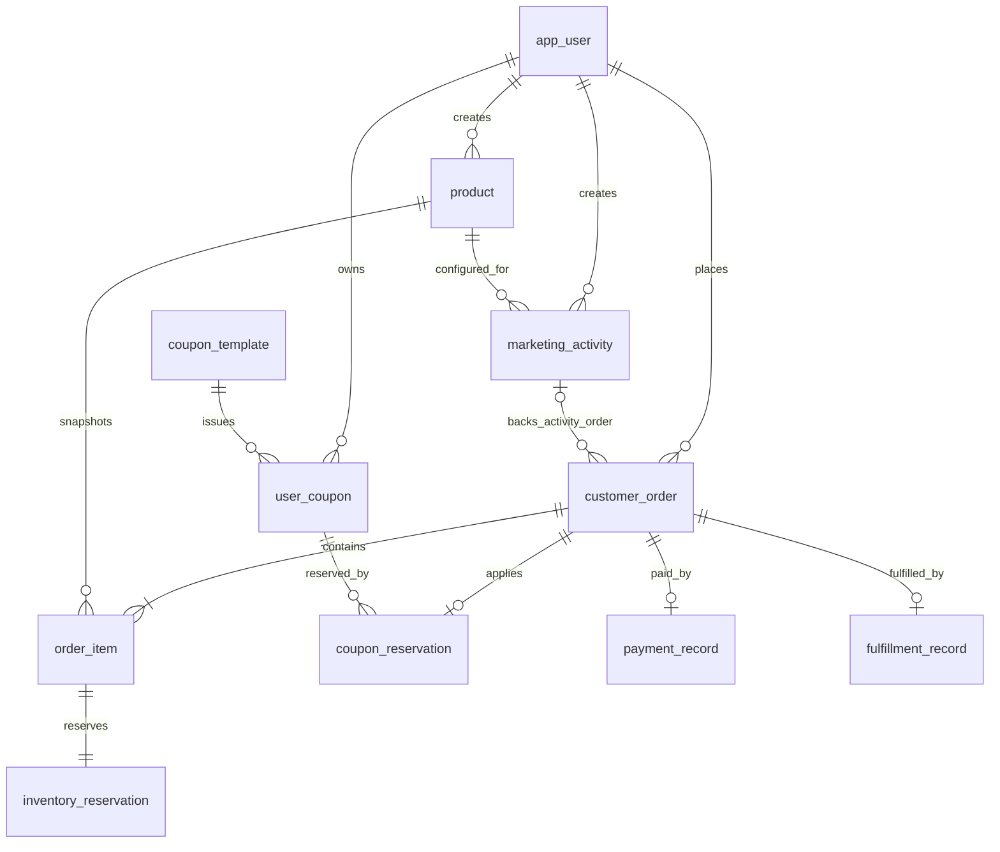

# 数据库设计（PostgreSQL 16）

本设计把 PostgreSQL 作为业务数据的权威来源；Redis/MQ 是高并发入口、削峰和异步传递机制，不替代本库的最终审计记录与状态约束。金额均以最小货币单位 `*_minor` 的整数保存，时间均为 `timestamptz`。

## 1. 领域关系

## 2. 表与职责

| 领域 | 表 | 说明 |
|---|---|---|
| 用户与商品 | `app_user`、`product` | 用户/运营角色、商品资料、直接购买可用库存。 |
| 活动与限购 | `marketing_activity`、`activity_user_quota` | 一个活动绑定一个商品；活动库存是独立库存池，不扣减 `product.available_stock`；限购计数包含待支付保留和已支付订单。 |
| 优惠券 | `coupon_template`、`user_coupon`、`coupon_user_claim_counter`、`coupon_reservation` | 满减券模板、用户持券、限领计数、订单锁券/核销/释放审计。券可用于任何符合金额与时间条件的订单；锁券记录由复合外键保证与订单、持券人属于同一用户。 |
| 订单 | `customer_order`、`order_item`、`order_submission_idempotency` | 订单头、不可变商品/价格快照、客户端提交幂等映射。 |
| 库存 | `inventory_reservation`、`inventory_movement` | 每个订单项唯一的一次库存保留，以及保留/释放流水。 |
| 支付与履约 | `payment_record`、`fulfillment_record` | 每单至多一个支付记录；模拟支付成功后自动建立完成态履约记录。 |

完整 DDL 位于 [001_initial_schema.sql](../db/001_initial_schema.sql)。

## 3. 订单模型与不变量

`customer_order.kind` 仅有两类：

- `ACTIVITY`：必须关联活动；只能有一个订单项，且订单项商品必须是该活动配置的商品。它只保留活动库存。
- `DIRECT`：不能关联活动；可含一个或多个普通商品订单项。所有商品库存必须在同一事务内全部保留，否则整个下单失败。

活动订单与直接购买商品不能混在同一订单。所有订单在创建时保留库存，支付期限为创建后 15 分钟。超时或用户取消时，只能从 `PENDING_PAYMENT` 原子地变更为 `CANCELLED`，并释放相应库存、活动限购名额和仍在有效期内的优惠券。

订单金额和名称不依赖实时商品/活动/券配置：`order_item` 保存 SKU、商品名、标价、成交价和活动优惠快照；`coupon_reservation` 保存券门槛和优惠金额快照。

## 4. 状态与并发规则

| 对象 | 状态/规则 |
|---|---|
| 订单 | `PENDING_PAYMENT → PAID → COMPLETED`，或 `PENDING_PAYMENT → CANCELLED`；DDL 触发器拒绝其他转换。 |
| 用户券 | `AVAILABLE → RESERVED → CONSUMED`；超时/取消时，仍在使用期内则回到 `AVAILABLE`，否则为 `EXPIRED`。 |
| 保留记录 | `RESERVED → CONFIRMED`（支付成功）或 `RESERVED → RELEASED`（取消/超时）。 |
| 活动 | 仅未开始活动可取消；暂停只阻止新下单，已创建的待支付订单仍可在自身到期前支付。 |
| 幂等 | `order_submission_idempotency` 对 `(user_id, idempotency_key)` 唯一；同键重试返回初次处理结果。 |

库存、券领取、限购和支付/超时竞争必须在服务层的单一数据库事务中执行。关键扣减使用带条件的 `UPDATE ... WHERE available_stock >= :qty` / `... committed_quantity + :qty <= :limit`，以受影响行数作为成功判定；不得先查询再无条件更新。活动边界以该事务中的数据库服务器时间为准。

## 5. 审核要点

- `marketing_activity.available_stock` 是活动订单唯一库存权威；`product.available_stock` 只服务直接订单，二者故意不自动同步。
- 订单项数量、订单金额、券适用性与活动限购是服务事务中的业务校验；DDL 提供不可绕过的基础形状、唯一性、非负数和合法订单状态约束。
- 运营侧禁止修改已经开始的活动价格/库存规则与已开始发放券的核心规则，应由应用层按状态拦截，并依赖订单快照保证历史不变。
