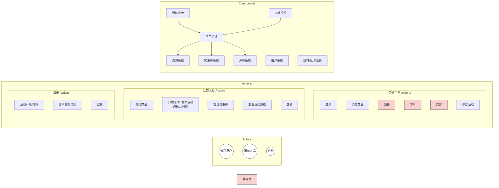

```mermaid
flowchart LR
    %% 顶部注释
    Idempotency[幂等性]

    subgraph Actors [Actors]
        direction TB
        A1((普通用户))
        A2((运营人员))
        A3((系统))
    end

    subgraph Actions [Actions]
        direction TB
        
        %% 分组1：普通用户动作
        subgraph UserActions ["普通用户 Actions"]
            direction TB
            U1[登录]
            U2[浏览商品]
            U3[领券]
            U4[下单]
            U5[支付]
            U6[参加活动]
        end

        %% 分组2：运营人员动作
        subgraph OpsActions ["运营人员 Actions"]
            direction TB
            O1[管理商品]
            O2[创建活动, 暂停活动<br>必须高可用]
            O3[管理优惠券]
            O4[查看活动数据]
            O5[登录]
        end

        %% 分组3：系统动作
        subgraph SysActions ["系统 Actions"]
            direction TB
            S1[活动开始/结束]
            S2[订单超时取消]
            S3[鉴权]
        end
    end

    subgraph Components [Components]
        direction TB
        C1[活动系统]
        C2[商城系统]
        C3[下单系统]
        C4[支付系统]
        C5[优惠券系统]
        C6[库存系统]
        C7[用户系统]
        C8[定时/延时任务]
    end

    %% 组件间的连接箭头
    C1 --> C3
    C2 --> C3
    C3 --> C4
    C3 --> C5
    C3 --> C6

    %% 样式设置（匹配原图中的粉色高亮）
    classDef pink fill:#FAD1D1,stroke:#333,stroke-width:1px;
    class U3,U4,U5 pink;
    class Idempotency pink;

    %% 节点样式微调（让角色显示为圆形节点）
    classDef actorNode fill:#fff,stroke:#333;
    class A1,A2,A3 actorNode;
```