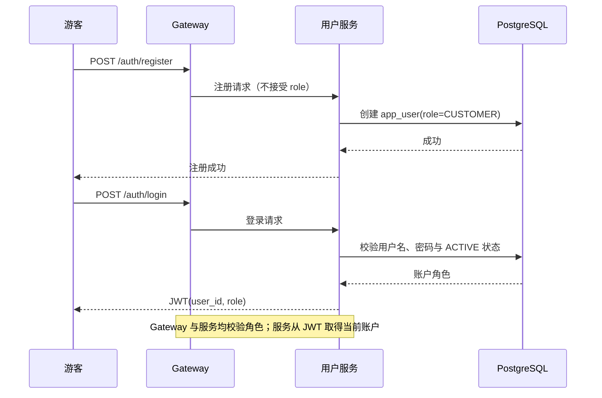
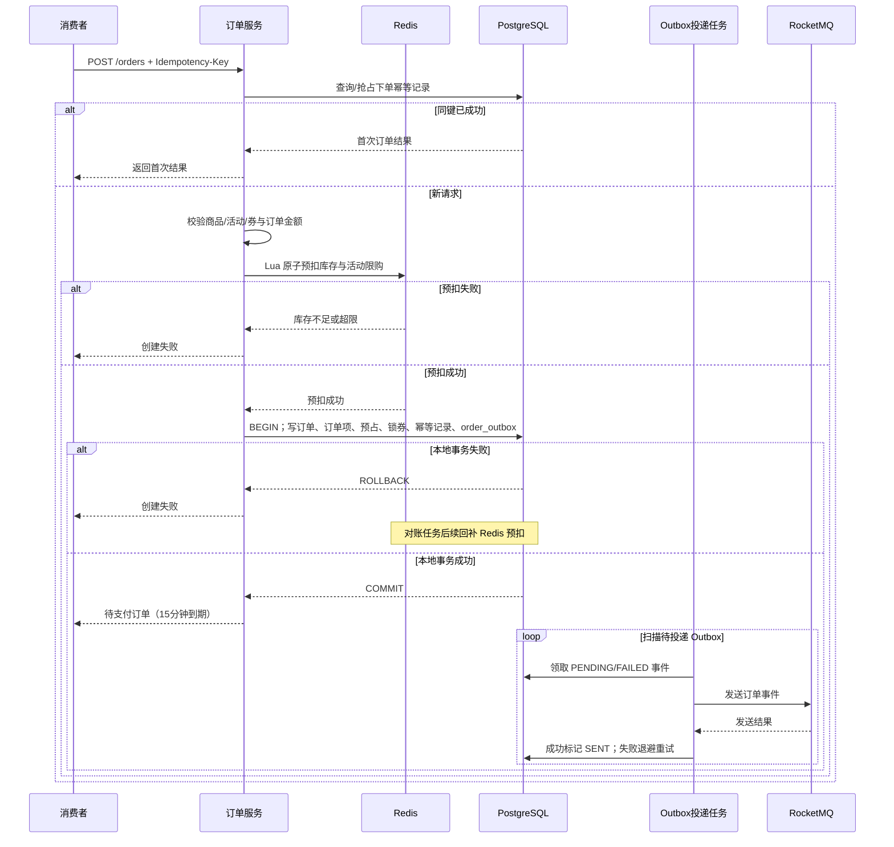
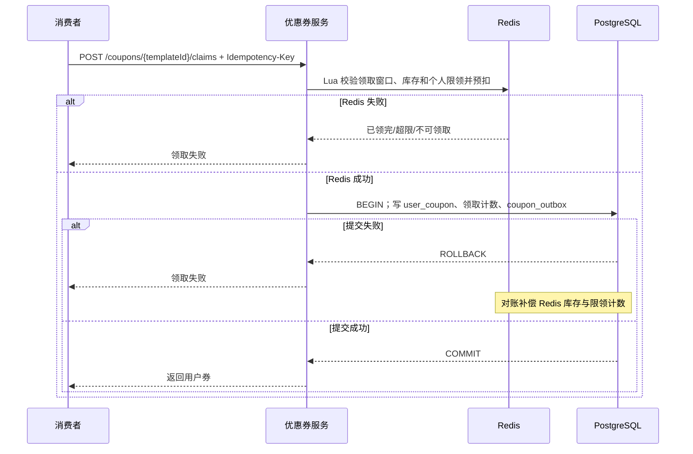
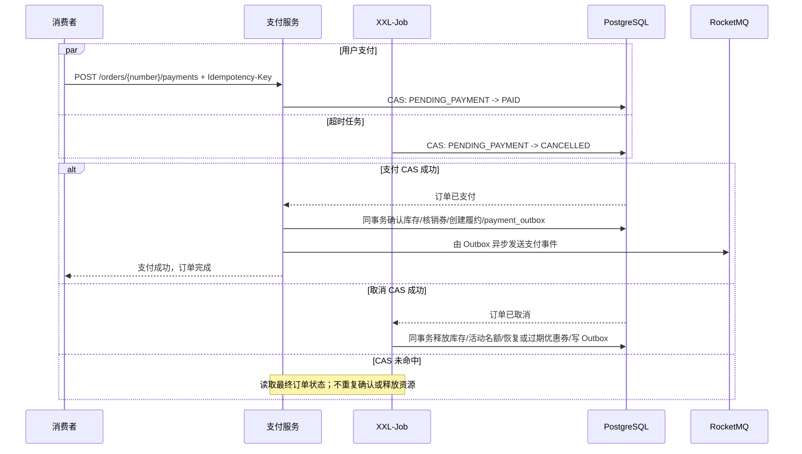
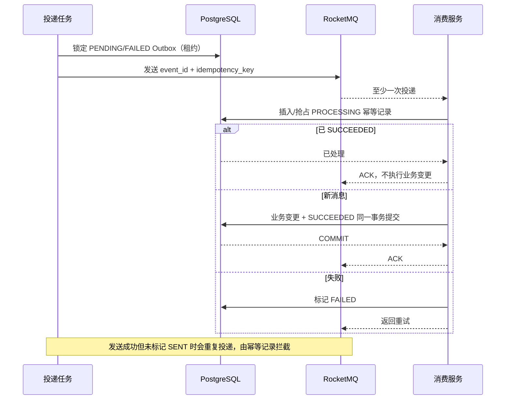
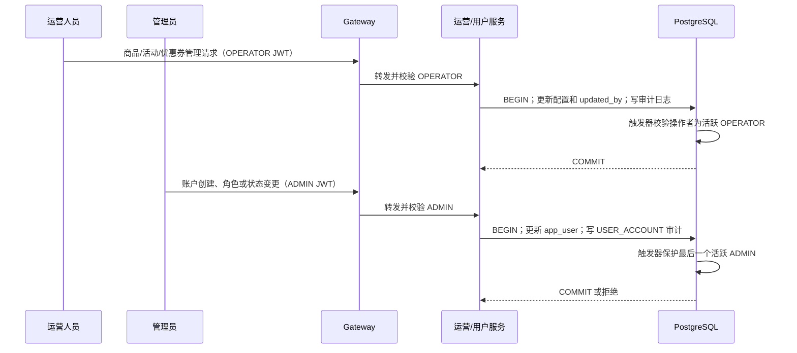

# 关键业务时序设计（一期）

## 1. 认证与角色隔离

`CUSTOMER` 只能操作自己的订单和优惠券；`OPERATOR` 只能管理商品、活动、优惠券；`ADMIN` 只能管理账户与角色。角色不匹配返回 `FORBIDDEN`，资源不属于当前消费者返回 `RESOURCE_ACCESS_DENIED`。

## 2. 创建订单与 Redis 预扣

## 3. 领取优惠券

## 4. 支付与超时取消竞争

## 5. Outbox 重复投递与消费幂等

## 6. 运营配置与账户管理

## 7. 对账与补偿

XXL-Job 关联 Redis 预扣记录、PostgreSQL 业务状态、Outbox 状态、MQ 消费状态和库存/优惠券流水。补偿操作必须记录原因、原状态、目标状态和 Trace ID，并使用 CAS 保证可重复执行而不重复扣减或释放。
