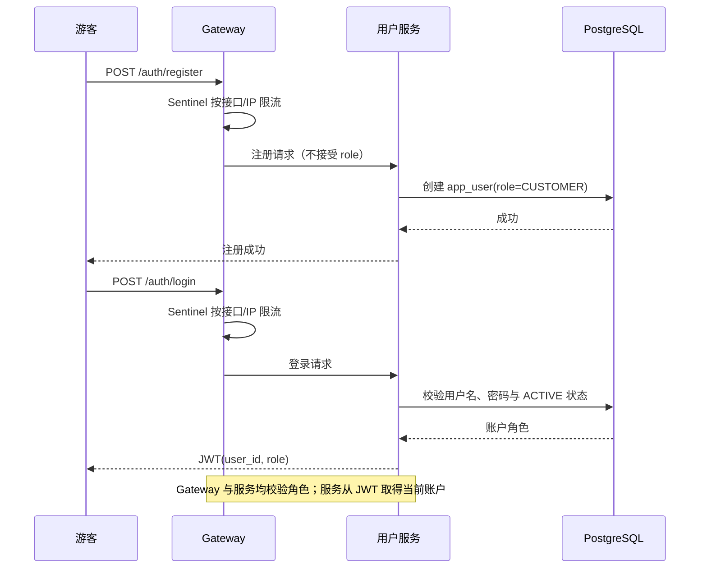
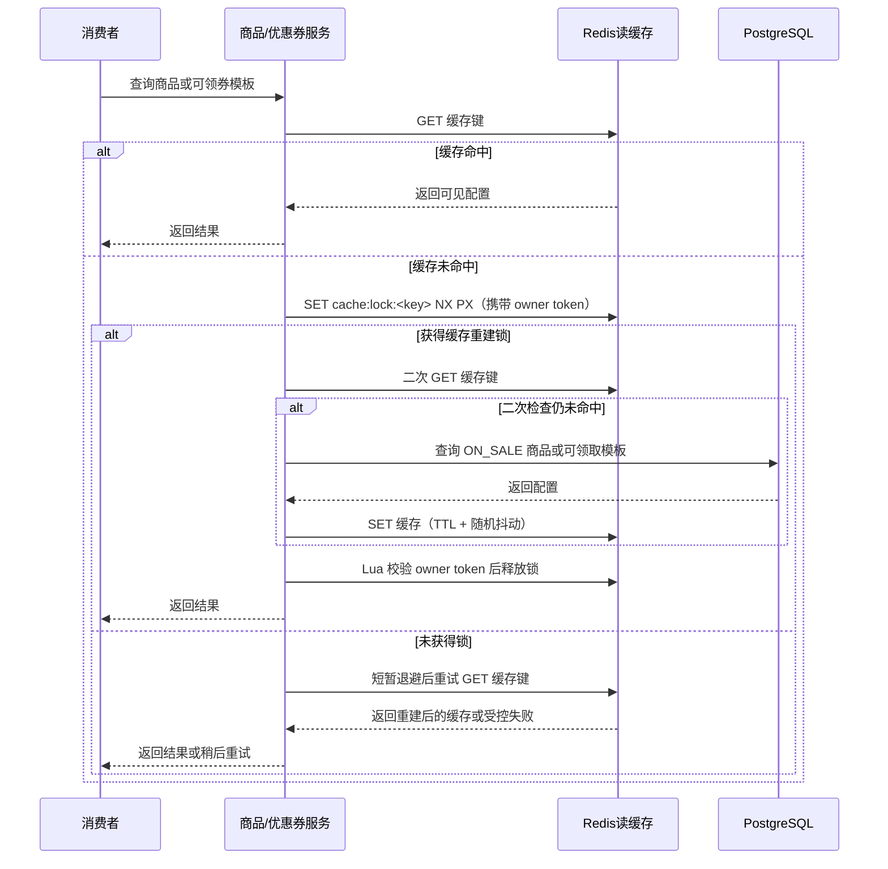
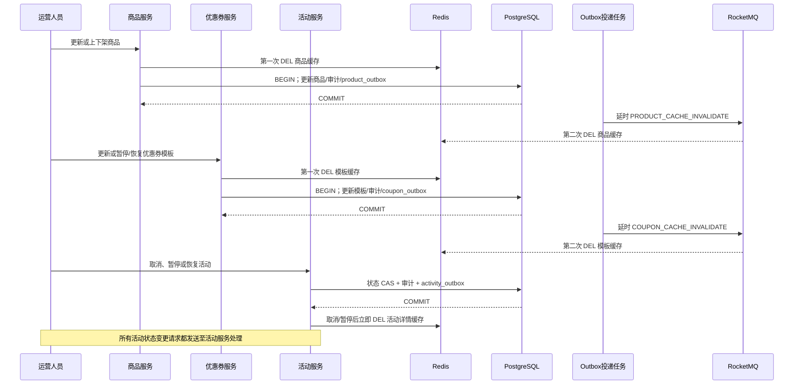
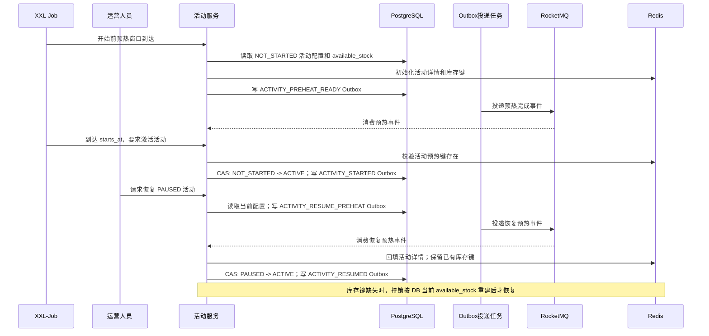
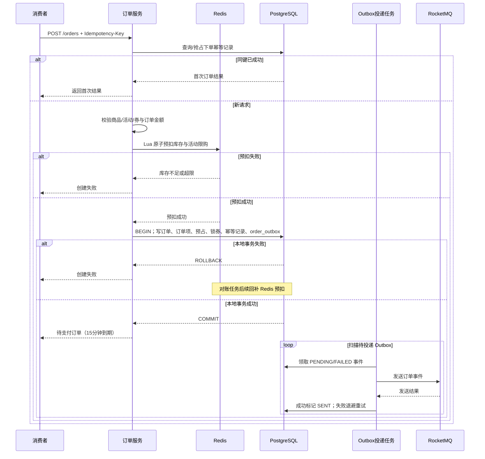
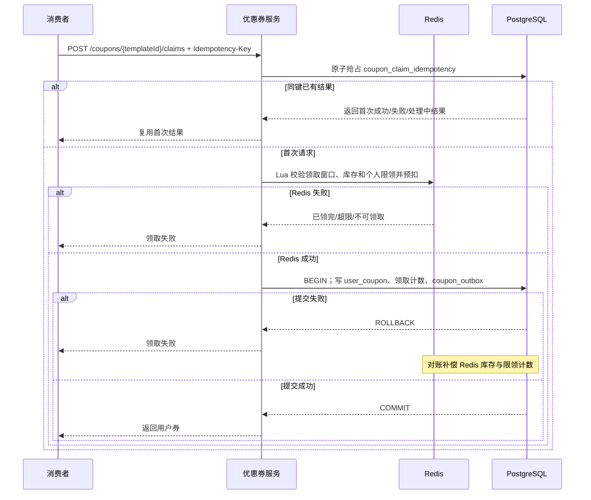
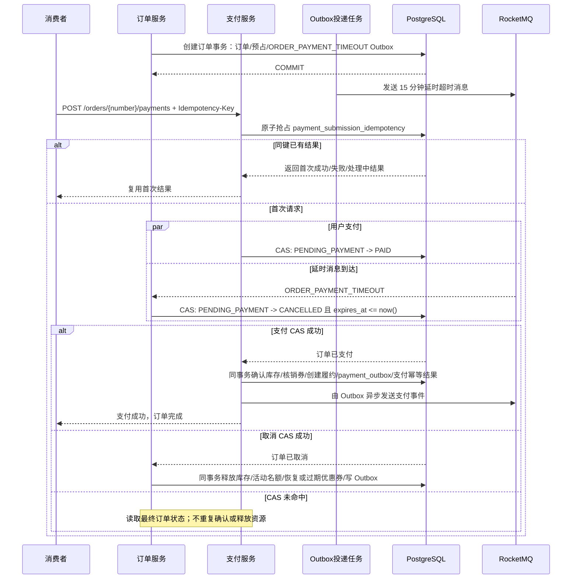
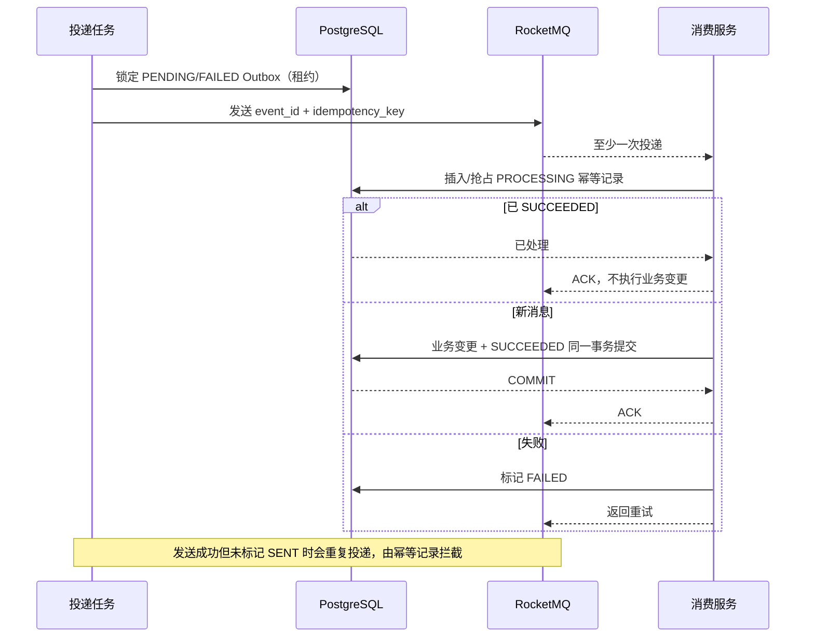
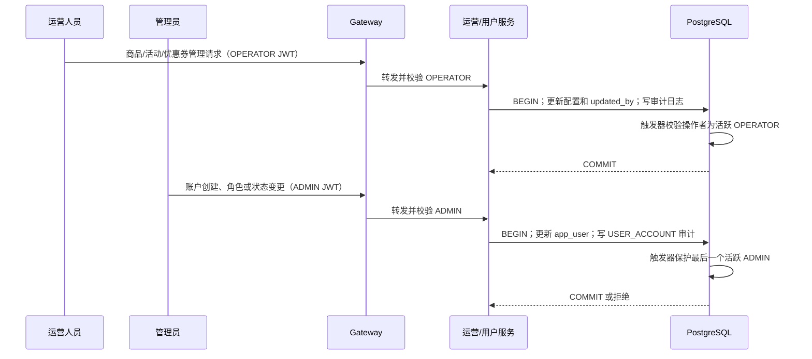

# 关键业务时序设计（一期）

## 1. 请求入口、认证与角色隔离

`CUSTOMER` 只能操作自己的订单和优惠券；`OPERATOR` 只能管理商品、活动、优惠券；`ADMIN` 只能管理账户与角色。角色不匹配返回 `FORBIDDEN`，资源不属于当前消费者返回 `RESOURCE_ACCESS_DENIED`。

文字说明：

1. 注册入口不允许调用方提交角色、状态或操作者字段，服务端只创建可用的 `CUSTOMER` 账户。
2. 登录仅为启用账户签发 JWT；被禁用账户不能获得新的访问令牌。
3. Gateway 是第一层拦截，业务服务必须再次校验 JWT 角色和资源归属，防止绕过网关或内部调用越权。
4. `OPERATOR` 与 `ADMIN` 的权限不互通：前者管理业务配置，后者管理账户与角色。
5. 所有请求在 Gateway 经过 Sentinel 限流；活动下单和领券还必须配置更细的接口/热点参数限流。被限流请求直接返回 `RATE_LIMITED`，不得进入 Redis、数据库或 MQ 主流程。
6. 所有关键流程透传 Trace ID，并记录结构化日志和业务指标；SkyWalking 链路、Prometheus 指标、Loki 日志与 Alertmanager 告警的组件配置和指标口径保留在 `cross-cutting-design.md`，不为每条业务时序重复绘制。

## 2. 商品/优惠券模板读缓存

文字说明：

1. 非活动商品详情/列表和可领取优惠券模板采用 Cache Aside 读缓存；缓存只加速读取，不作为库存、券状态或业务审计的权威来源。
2. 缓存未命中时先用 Redis `SET NX PX` 获取按缓存键粒度的重建锁；获得锁后必须二次检查缓存，只有仍未命中时才查询数据库并回填。释放锁使用 Lua 比对 owner token，不能直接删除他人锁。
3. 未获得锁的请求不查询数据库，只做短暂退避和有限次缓存重试；重试后仍未命中则受控失败/稍后重试，避免高并发请求穿透到数据库。缓存 TTL 加随机抖动，降低集中失效风险。
## 3. 运营写入缓存失效与活动状态通知

文字说明：

1. 商品和优惠券模板的配置更新采用延迟双删：先删缓存，再在本地事务写配置、审计和所属服务 Outbox，最后通过延时事件执行第二次删除；服务端不直接回写缓存。
2. 商品下架、活动取消/暂停、优惠券暂停/结束领取均属于消费者视图的逻辑删除，提交后立即失效对应缓存。第一阶段不提供物理删除接口。
3. 活动不允许更新配置。取消、暂停、恢复和调度开始等状态变更必须发送至活动服务，由活动服务执行状态 CAS、审计和 `activity_outbox` 写入；其他服务不得直接修改活动状态。
4. 缓存失效事件允许重复执行；Redis `DEL` 天然幂等。Outbox、事件和缓存失效失败必须可监控和重试。

## 4. 活动开始前与恢复前缓存预热

文字说明：

1. 活动配置只有创建、取消、暂停和恢复；一期不允许修改活动商品、价格、库存、限购或时间等配置。
2. 调度任务在活动开始前的预热窗口请求活动服务预热。活动服务先以 PostgreSQL 的 `available_stock` 初始化 Redis 活动详情和库存键，再写预热完成事件；只有预热键存在时，开始时刻的激活请求才可将状态从 `NOT_STARTED` 原子切换为 `ACTIVE`。
3. 用户维度限购计数按用户参与活动时由 Lua 脚本原子初始化，不进行无意义的全量预热。
4. 暂停只禁止新下单并失效消费者活动详情缓存，保留 Redis 库存键和已有预扣状态。恢复请求先由活动服务预热详情；仅预热完成后才执行 `PAUSED → ACTIVE`。绝不能重置库存键；若键丢失，才在互斥锁保护下从数据库当前值重建。
5. 预热事件、缓存写入和库存键重建均允许重试；失败需告警，活动服务在未完成预热时不得开放新的活动下单请求。

## 5. 创建订单与 Redis 预扣

文字说明：

1. 下单幂等以 `(user_id, Idempotency-Key)` 和请求指纹判定；同键同请求重试返回首次结果，同键不同请求拒绝。
2. 订单服务在预扣前校验商品上架、活动时间窗口、限购、优惠券归属/有效期/门槛及金额；活动边界以 PostgreSQL 服务器时间为准。
3. Redis 预扣成功后，订单、订单项、库存保留、优惠券锁定、下单幂等记录和 `order_outbox` 必须同一个本地事务提交。任一数据库写入失败时，不创建订单。
4. Redis 已预扣但本地事务失败时允许短暂不一致；对账任务以 PostgreSQL 业务记录为最终权威回补 Redis。
5. 用户收到下单成功时订单已持久化，但事件仍可能尚未投递；Outbox 负责后续可靠投递，不阻塞用户响应。

## 6. 领取优惠券

文字说明：

1. 领券请求先以 `(user_id, coupon_template_id, Idempotency-Key)` 原子抢占 `coupon_claim_idempotency`；同键重试复用首次成功、失败或处理中结果，不会再次 Redis 预扣。
2. 首次请求再校验模板状态、领取时间、发行余量和个人限领数量；Redis Lua 将这些高并发判断和预扣合并为原子操作。
3. Redis 成功后，`user_coupon`、领取计数、领券请求幂等结果和 `coupon_outbox` 在 PostgreSQL 同一事务中写入，确保已发券必有可投递事件。
4. PostgreSQL 提交失败不能向消费者返回成功；Redis 的预扣余量和个人计数由对账任务恢复。MQ 事件重复投递时由消费端幂等记录表去重。

## 7. 支付与延时超时取消竞争

文字说明：

1. 支付请求先以 `(user_id, order_id, Idempotency-Key)` 原子抢占 `payment_submission_idempotency`；同键重试复用首次结果，不会再次发起支付处理。
2. 下单事务提交后，由 Outbox 投递 `ORDER_PAYMENT_TIMEOUT` 的 15 分钟 RocketMQ 延时消息；延时消息是超时取消的主触发路径。
3. 支付和延时消息消费都只能通过订单状态条件更新抢占 `PENDING_PAYMENT`，因此二者只有一个能成功。
4. 支付成功的事务要确认库存保留、核销已锁定优惠券、创建自动完成的履约记录、写支付 Outbox 并完成支付幂等结果；任一项失败则支付状态变更不提交。
5. 超时取消的事务释放对应库存；活动订单还要释放活动限购名额；锁定优惠券根据使用截止时间恢复为 `AVAILABLE` 或标记 `EXPIRED`。
6. 未抢到状态转换的一方只读取最终状态：已支付不再释放资源，已取消不再支付，避免重复确认或重复释放。
7. XXL-Job 只作为兜底对账：扫描 `expires_at <= now()` 但仍为 `PENDING_PAYMENT` 的订单，补偿延时消息投递、Broker 或消费者异常造成的遗漏。

## 8. Outbox 重复投递与消费幂等

文字说明：

1. Outbox 采用至少一次投递。投递任务通过状态、可投递时间和租约领取事件；发送失败记录错误并按退避时间重试。
2. 消息发送成功但 Outbox 更新为 `SENT` 前进程宕机时，下一次扫描会重复发送，这是预期行为。
3. 每个消费者服务用自身的幂等记录表以业务前缀幂等号抢占处理权。已 `SUCCEEDED` 的重复消息只 ACK，不执行业务变更。
4. 新消息的领域写入与幂等状态改为 `SUCCEEDED` 必须同一 PostgreSQL 事务提交。失败记录为 `FAILED` 并由 RocketMQ 重试；长时间 `PROCESSING` 由恢复任务处理。

## 9. 运营配置与账户管理

文字说明：

1. 运营写请求的操作者只来自 OPERATOR JWT。服务不能采信前端提交的 `created_by`、`updated_by` 或审计快照。
2. 商品、活动、优惠券的配置更新、修改人更新和审计日志必须同一事务提交；数据库触发器拒绝非活跃 OPERATOR 作为配置操作者。
3. ADMIN 只能创建账户、修改角色和启停账户，同时写入目标类型为 `USER_ACCOUNT` 的审计记录；ADMIN 不拥有运营配置权限。
4. 应用层拒绝管理员修改/禁用自身；数据库还会拒绝移除、降级或禁用最后一个活跃 ADMIN，防止后台失去管理入口。

## 10. 对账与补偿

XXL-Job 关联 Redis 预扣记录、PostgreSQL 业务状态、Outbox 状态、MQ 消费状态和库存/优惠券流水。补偿操作必须记录原因、原状态、目标状态和 Trace ID，并使用 CAS 保证可重复执行而不重复扣减或释放。

文字说明：

1. Redis 与 PostgreSQL 的差异以 PostgreSQL 已提交的业务状态为准；只在 Redis 有预扣而业务记录不存在时回补预扣。
2. 长时间未投递的 Outbox、长时间 `PROCESSING` 的消费记录、消息持续失败和死信消息均需告警并进入补偿队列。
3. 补偿任务可被重复执行，所有库存、优惠券和订单更新均带状态条件；补偿结果写入日志、指标和 Trace 关联字段以便审计。
