# 关键业务时序设计（一期）

## 1. 请求入口、认证与角色隔离

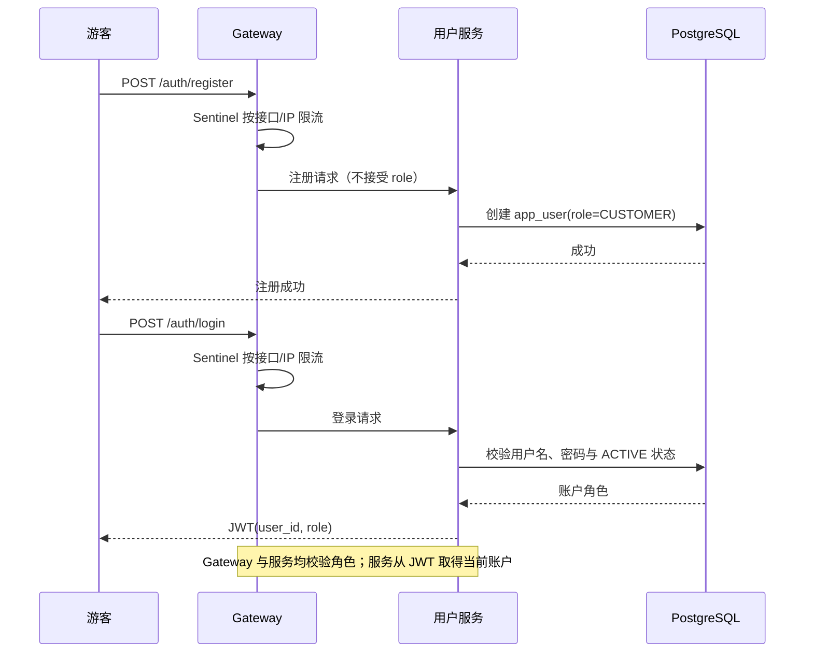

`CUSTOMER` 只能操作自己的订单和优惠券；`OPERATOR` 只能管理商品、活动、优惠券；`ADMIN` 只能管理账户与角色。角色不匹配返回 `FORBIDDEN`，资源不属于当前消费者返回 `RESOURCE_ACCESS_DENIED`。

文字说明：

1. 注册入口不允许调用方提交角色、状态或操作者字段，服务端只创建可用的 `CUSTOMER` 账户。
2. 登录仅为启用账户签发 JWT；被禁用账户不能获得新的访问令牌。
3. Gateway 是第一层拦截，业务服务必须再次校验 JWT 角色和资源归属，防止绕过网关或内部调用越权。
4. `OPERATOR` 与 `ADMIN` 的权限不互通：前者管理业务配置，后者管理账户与角色。
5. 所有请求在 Gateway 经过 Sentinel 限流；活动下单和领券还必须配置更细的接口/热点参数限流。被限流请求直接返回 `RATE_LIMITED`，不得进入 Redis、数据库或 MQ 主流程。
6. 所有关键流程透传 Trace ID，并记录结构化日志和业务指标；SkyWalking 链路、Prometheus 指标、Loki 日志与 Alertmanager 告警的组件配置和指标口径保留在 `cross-cutting-design.md`，不为每条业务时序重复绘制。

## 2. 商品/优惠券模板读缓存

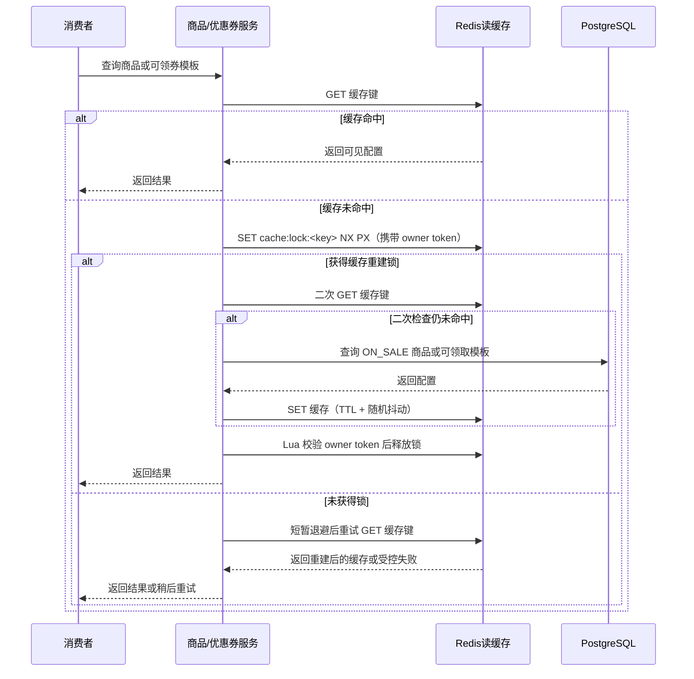

文字说明：

1. 非活动商品详情/列表和可领取优惠券模板采用 Cache Aside 读缓存；缓存只加速读取，不作为库存、券状态或业务审计的权威来源。
2. 缓存未命中时先用 Redis `SET NX PX` 获取按缓存键粒度的重建锁；获得锁后必须二次检查缓存，只有仍未命中时才查询数据库并回填。释放锁使用 Lua 比对 owner token，不能直接删除他人锁。
3. 未获得锁的请求不查询数据库，只做短暂退避和有限次缓存重试；重试后仍未命中则受控失败/稍后重试，避免高并发请求穿透到数据库。缓存 TTL 加随机抖动，降低集中失效风险。
## 3. 商品与优惠券运营写入缓存失效

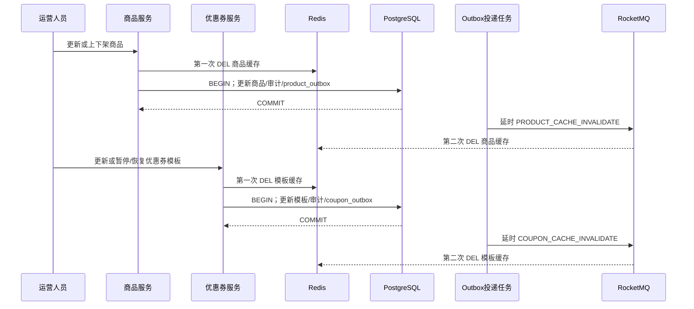

文字说明：

1. 商品和优惠券模板的配置更新采用延迟双删：先删缓存，再在本地事务写配置、审计和所属服务 Outbox，最后通过延时事件执行第二次删除；服务端不直接回写缓存。
2. 商品下架、优惠券暂停/结束领取均属于消费者视图的逻辑删除，提交后立即失效对应缓存。第一阶段不提供物理删除接口。
3. 缓存失效事件允许重复执行；Redis `DEL` 天然幂等。Outbox、事件和缓存失效失败必须可监控和重试。

## 4. 活动取消与暂停屏障

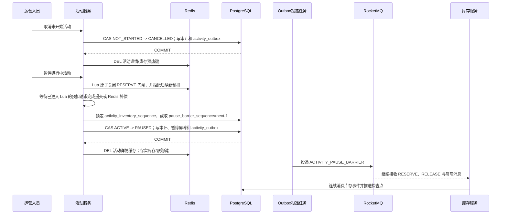

文字说明：

1. 一期活动创建后不再修改商品、价格、库存、限购和时间配置；运营人员仅能取消未开始活动、暂停进行中活动、请求恢复已暂停活动。
2. 取消仅适用于 `NOT_STARTED → CANCELLED`，清理未投入使用的预热键；它不是暂停，不创建暂停/恢复屏障。
3. 暂停先关闭 Redis 的新 `RESERVE` 门闸，再等待已进入预扣 Lua 的请求全部完成：每个请求要么与订单、库存保留、`activity_inventory_event(RESERVE)`、`order_outbox` 同事务提交，要么完成 Redis 补偿。随后在数据库锁住 `activity_inventory_sequence` 并以 `next_event_sequence - 1` 截取 `pause_barrier_sequence`，最后才提交 `ACTIVE → PAUSED`。因此屏障前不会遗漏已接受且尚未入账的预扣。
4. 暂停前已提交的 `RESERVE`，以及暂停期间订单取消/超时产生的 `RELEASE`，必须继续经 Outbox/MQ 投递、由库存服务消费；不得因活动是 `PAUSED` 被丢弃、拒绝或回滚。暂停只失效活动详情缓存，保留库存和限购键，释放仍会回补实时库存。
5. 活动取消、暂停、恢复和开始状态变更都只允许活动服务执行；商品、订单和库存服务不得直接改活动状态。缓存失效与库存事件按至少一次投递，以状态 CAS、事件序号和消费者幂等处理重复。

## 5. 活动开始前预热与异步恢复

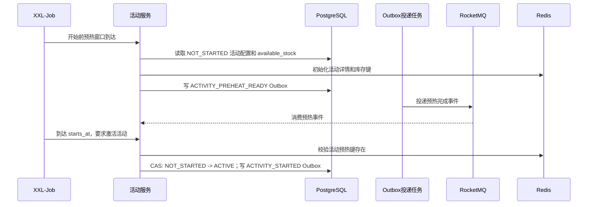

文字说明：

1. 调度任务在开始前预热窗口内以 PostgreSQL 的初始配置写入活动详情和库存键；仅当预热键存在，开始时刻的请求才可 CAS `NOT_STARTED → ACTIVE`。用户限购计数按首次参与活动由 Lua 初始化，不做全量预热。
2. 预热只适用于从未开始的活动。活动进行中 Redis 是实时可售库存权威，`marketing_activity.available_stock` 是可滞后的投影，不能在恢复时直接覆盖 Redis。

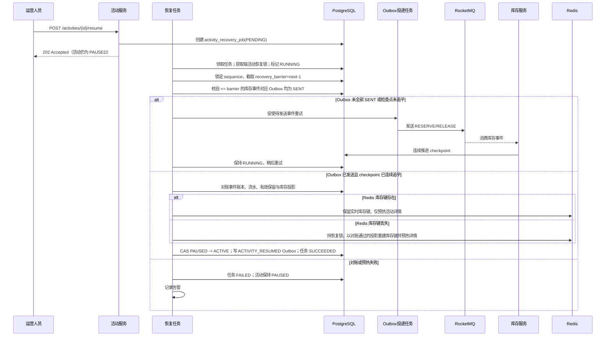

3. 恢复为异步操作。恢复任务截取的是当前已提交事件账本的 `recovery_barrier_sequence`；它覆盖暂停前预扣及暂停期间全部已产生的释放。每个不大于该屏障的事件必须先确认其生产端 Outbox 已 `SENT`，并且 `activity_inventory_checkpoint.last_contiguous_sequence` 连续追平该屏障。
4. 只有上述条件和账本对账都成功后才可预热详情并 CAS `PAUSED → ACTIVE`。Redis 库存键存在时绝不覆盖；键丢失时也只能在恢复互斥锁下，用已追平且已对账的投影重建。失败时任务为 `FAILED`、触发告警且活动持续 `PAUSED`。
5. 恢复任务运行期间，暂停状态继续拒绝新预扣，但所有既有订单支付、取消、超时以及其 `RELEASE` 均继续处理；它们在恢复屏障之后到达时由下一次恢复任务重新截取并验证。

## 6. 创建订单与 Redis 预扣

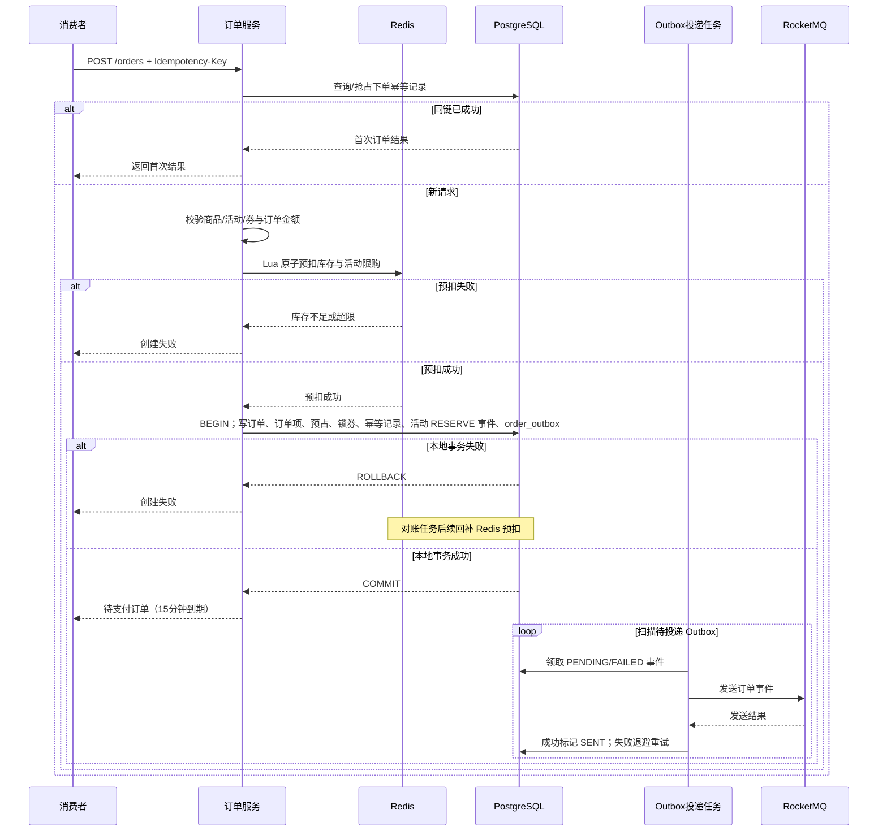

文字说明：

1. 下单幂等以 `(user_id, Idempotency-Key)` 和请求指纹判定；同键同请求重试返回首次结果，同键不同请求拒绝。
2. 订单服务在预扣前校验商品上架、活动时间窗口、限购、优惠券归属/有效期/门槛及金额；活动边界以 PostgreSQL 服务器时间为准。
3. Redis 预扣成功后，订单、订单项、库存保留、优惠券锁定、下单幂等记录和 `order_outbox` 必须同一个本地事务提交。活动订单还在该事务锁定 `activity_inventory_sequence`、分配连续序号，并写 `activity_inventory_event(RESERVE)`；它与承载该事件的 `order_outbox` 关联。任一数据库写入失败时，不创建订单。
4. Redis 已预扣但本地事务失败时允许短暂不一致；对账任务以 PostgreSQL 业务记录为最终权威回补 Redis。
5. 用户收到下单成功时订单已持久化，但事件仍可能尚未投递；Outbox 负责后续可靠投递，不阻塞用户响应。

## 7. 领取优惠券

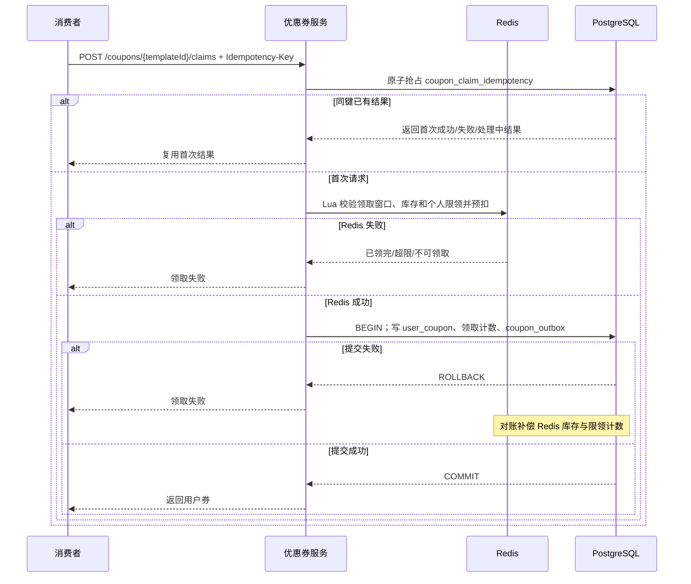

文字说明：

1. 领券请求先以 `(user_id, coupon_template_id, Idempotency-Key)` 原子抢占 `coupon_claim_idempotency`；同键重试复用首次成功、失败或处理中结果，不会再次 Redis 预扣。
2. 首次请求再校验模板状态、领取时间、发行余量和个人限领数量；Redis Lua 将这些高并发判断和预扣合并为原子操作。
3. Redis 成功后，`user_coupon`、领取计数、领券请求幂等结果和 `coupon_outbox` 在 PostgreSQL 同一事务中写入，确保已发券必有可投递事件。
4. PostgreSQL 提交失败不能向消费者返回成功；Redis 的预扣余量和个人计数由对账任务恢复。MQ 事件重复投递时由消费端幂等记录表去重。

## 8. 支付与延时超时取消竞争

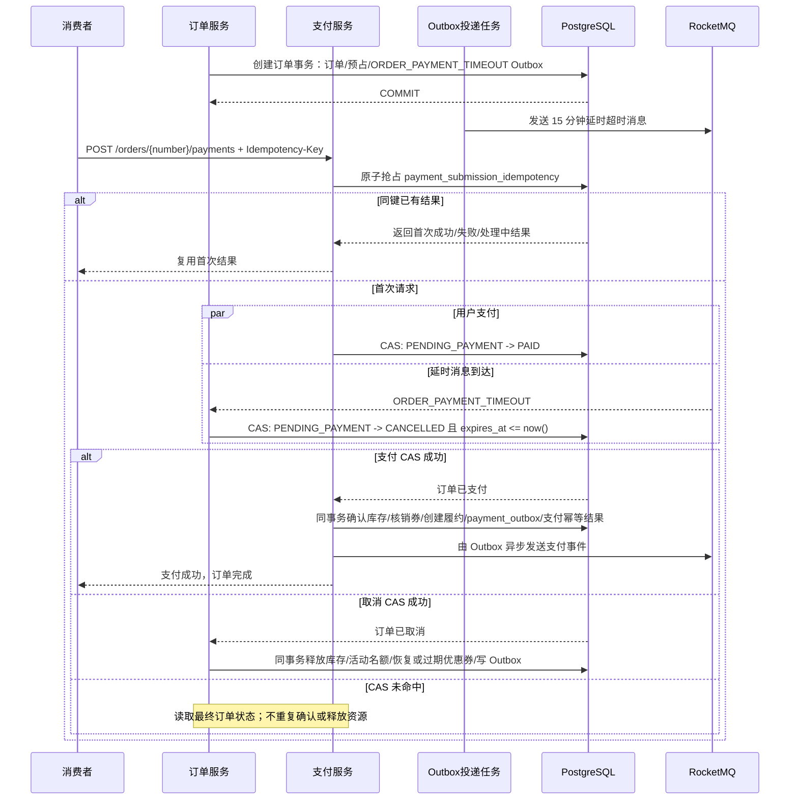

文字说明：

1. 支付请求先以 `(user_id, order_id, Idempotency-Key)` 原子抢占 `payment_submission_idempotency`；同键重试复用首次结果，不会再次发起支付处理。
2. 下单事务提交后，由 Outbox 投递 `ORDER_PAYMENT_TIMEOUT` 的 15 分钟 RocketMQ 延时消息；延时消息是超时取消的主触发路径。
3. 支付和延时消息消费都只能通过订单状态条件更新抢占 `PENDING_PAYMENT`，因此二者只有一个能成功。
4. 支付成功的事务要确认库存保留、核销已锁定优惠券、创建自动完成的履约记录、写支付 Outbox 并完成支付幂等结果；任一项失败则支付状态变更不提交。
5. 超时取消的事务释放对应库存；活动订单还要释放活动限购名额，并在同一事务分配活动事件序号、写 `activity_inventory_event(RELEASE)` 与 `STOCK_RELEASE` 的 `order_outbox`。锁定优惠券根据使用截止时间恢复为 `AVAILABLE` 或标记 `EXPIRED`。
6. 未抢到状态转换的一方只读取最终状态：已支付不再释放资源，已取消不再支付，避免重复确认或重复释放。
7. XXL-Job 只作为兜底对账：扫描 `expires_at <= now()` 但仍为 `PENDING_PAYMENT` 的订单，补偿延时消息投递、Broker 或消费者异常造成的遗漏。

## 9. 订单取消/超时后的活动库存回补

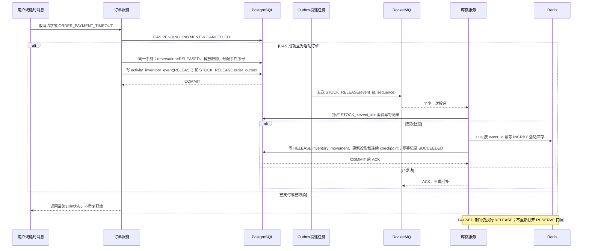

文字说明：

1. 用户取消与延时超时共用订单状态 CAS，只有取得 `PENDING_PAYMENT → CANCELLED` 的一方产生一次释放事件；其他调用只读最终状态。
2. 对活动订单，订单服务在取消事务中将保留记录改为 `RELEASED`、释放活动限购、锁定活动序号并写入 `activity_inventory_event(RELEASE)` 和同一条生产端 `order_outbox`。`activity_inventory_event.outbox_event_id` 指向该 Outbox 事件，故恢复任务可检查事件是否已投递。
3. 库存服务按 `STOCK_<event_id>` 消费幂等。Redis 回补 Lua 也保存事件标记，确保数据库提交失败后的消息重试不会重复 `INCRBY`；随后在一个 PostgreSQL 事务写库存流水、更新 `marketing_activity.available_stock` 投影和连续检查点，并将消费记录置为 `SUCCEEDED`。Redis 标记仅可在持久化成功且对账后按保留策略清理。
4. `RESERVE` 的 Redis 扣减已在下单 Lua 完成；库存服务消费其事件只写库存流水、投影和检查点，不再次扣减 Redis。`RELEASE` 即使活动暂停、恢复任务运行或决定不恢复，也必须继续回补 Redis 和推进检查点。

## 10. Outbox 重复投递与消费幂等

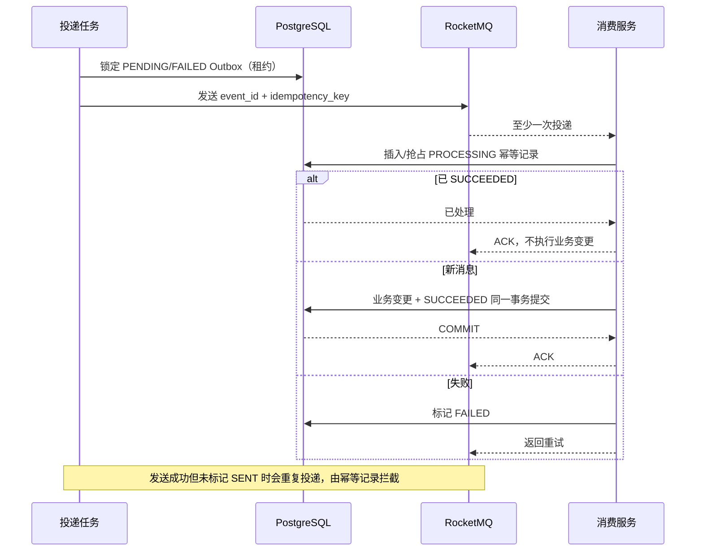

文字说明：

1. Outbox 采用至少一次投递。投递任务通过状态、可投递时间和租约领取事件；发送失败记录错误并按退避时间重试。
2. 消息发送成功但 Outbox 更新为 `SENT` 前进程宕机时，下一次扫描会重复发送，这是预期行为。
3. 每个消费者服务用自身的幂等记录表以业务前缀幂等号抢占处理权。已 `SUCCEEDED` 的重复消息只 ACK，不执行业务变更。
4. 新消息的领域写入与幂等状态改为 `SUCCEEDED` 必须同一 PostgreSQL 事务提交。失败记录为 `FAILED` 并由 RocketMQ 重试；长时间 `PROCESSING` 由恢复任务处理。

## 11. 运营配置与账户管理

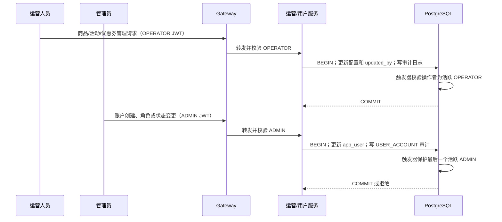

文字说明：

1. 运营写请求的操作者只来自 OPERATOR JWT。服务不能采信前端提交的 `created_by`、`updated_by` 或审计快照。
2. 商品、活动、优惠券的配置更新、修改人更新和审计日志必须同一事务提交；数据库触发器拒绝非活跃 OPERATOR 作为配置操作者。
3. ADMIN 只能创建账户、修改角色和启停账户，同时写入目标类型为 `USER_ACCOUNT` 的审计记录；ADMIN 不拥有运营配置权限。
4. 应用层拒绝管理员修改/禁用自身；数据库还会拒绝移除、降级或禁用最后一个活跃 ADMIN，防止后台失去管理入口。

## 11. 对账与补偿

XXL-Job 关联 Redis 预扣记录、PostgreSQL 业务状态、Outbox 状态、MQ 消费状态和库存/优惠券流水。补偿操作必须记录原因、原状态、目标状态和 Trace ID，并使用 CAS 保证可重复执行而不重复扣减或释放。

文字说明：

1. Redis 与 PostgreSQL 的差异以 PostgreSQL 已提交的业务状态和完整库存流水为准；既要检查 Redis 有预扣而业务记录不存在，也要检查暂停期间释放事件是否已反映到 Redis。
2. 长时间未投递的 Outbox、长时间 `PROCESSING` 的消费记录、消息持续失败和死信消息均需告警并进入补偿队列。
3. 补偿任务可被重复执行，所有库存、优惠券和订单更新均带状态条件；补偿结果写入日志、指标和 Trace 关联字段以便审计。
